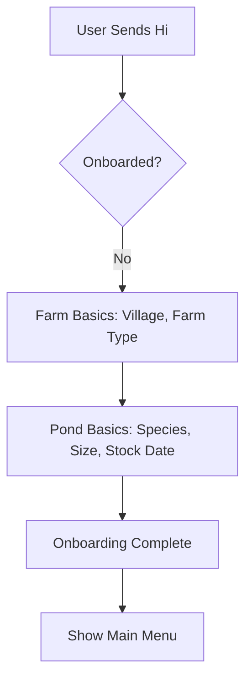

# 🌊 aquaIQ: System Interaction Flow Map

This document maps out the entire conversational experience and logic flow of the **aquaIQ** WhatsApp bot.

---

## 1. Onboarding Flow (First Time Users)
*Goal: Collect essential pond data progressively to avoid fatigue.*

---

## 2. Daily Check-In Rotation (Automated)
*Goal: Consistent data collection with zero typing (button-based).*

| Day | Focus | Data Collected | Logic / Alerts |
| :--- | :--- | :--- | :--- |
| **Monday** | **Feed** | Brand, Qty (kg), Frequency | Warns if frequency < 3x/day. |
| **Wednesday** | **Water** | Color, Smell, Foam | Detects Ammonia/Organic load risk. |
| **Friday** | **Health** | Symptoms, Growth Status | Cross-checks with AI for disease. |

---

## 3. The "Feed Plan" System (High Value)
*Goal: Deterministic feeding advice based on real-time pond status.*

**Trigger:** Farmer selects "Feed Plan" from Menu OR asks "How much feed today?"

**The Calculation Engine:**
1.  **Biomass Estimation**: (Seed Count) × (Estimated Survival) × (DOC-based ABW).
2.  **Base Rate**: % of biomass based on species growth curves.
3.  **Contextual Adjustments**:
    *   **-30% Feed**: If Wednesday log shows "Brown/Black" water or "Strong smell".
    *   **-50% Feed**: If Friday log shows "Slow growth" or "Disease signs".
    *   **STOP Feed**: If "White Spots" (WSSV) is detected in logs or via image.

---

## 4. Problem-Based Flows (Event Triggers)
*Goal: Guided troubleshooting when things go wrong.*

**Triggers:** Keywords (e.g., "dead shrimp") or Main Menu selection.

1.  **Disease Flow**:
    *   Identify signs (List Message).
    *   Collect mortality count.
    *   Provide immediate "Stop-Gap" advice.
    *   Schedule 2-day follow-up.
2.  **Water Quality Flow**:
    *   Check color/smell.
    *   Recommend specific products (e.g., Ammonia binders).
3.  **Mortality Flow**:
    *   Guided investigation into potential causes.

---

## 5. AI & Vision Features
*Goal: Expert-level intelligence.*

*   **AI Q&A (RAG)**: Uses the `SHRIMP_KB_AP_COMPLETE.md` to answer any technical question in the farmer's language.
*   **Disease Detection (Vision)**:
    *   User sends a photo.
    *   Bot analyzes symptoms (Vision model).
    *   Bot injects pond context (Species, Health Score) for a personalized diagnosis.

---

## 6. Interaction Logic (Main Menu)
*Goal: One-tap navigation.*

| Option | Action |
| :--- | :--- |
| **🔬 Disease** | Starts guided Disease Troubleshooting. |
| **🍽️ Feed Plan** | Runs `FeedPlanService` and sends instant daily calculator. |
| **💧 Water Quality** | Starts Water management guide. |
| **📈 Slow Growth** | Investigates FCR and nutrition. |
| **📊 Health Score** | Shows Current Pond Status (Green/Yellow/Red). |

---

## 7. Database Persistence
*Goal: Every data point counts.*

*   **Pond Logs (`pond_logs`)**: Stores all check-ins and feed plans in `jsonb`.
*   **Pond Status (`ponds`)**: Persists brand, stocking count, and current biomass.
*   **Chat History**: Every interaction is logged to train/improve the AI response.

---

## 8. Multi-Language Model
The entire flow is dynamic across **English**, **Telugu**, and **Hindi**.
*   All logic services (`dailyCheckIn.js`, `feedPlan.js`, etc.) use the `t()` helper.
*   No hardcoded strings in the interaction layer.
