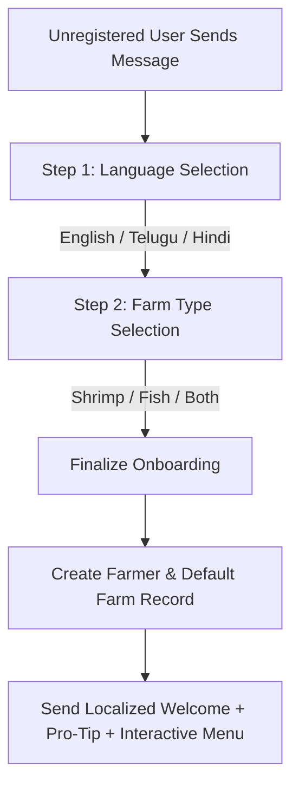
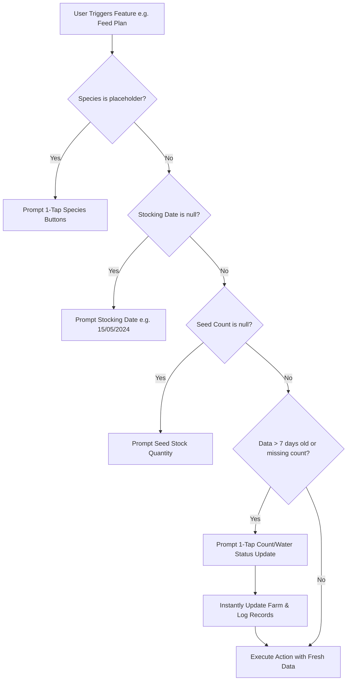
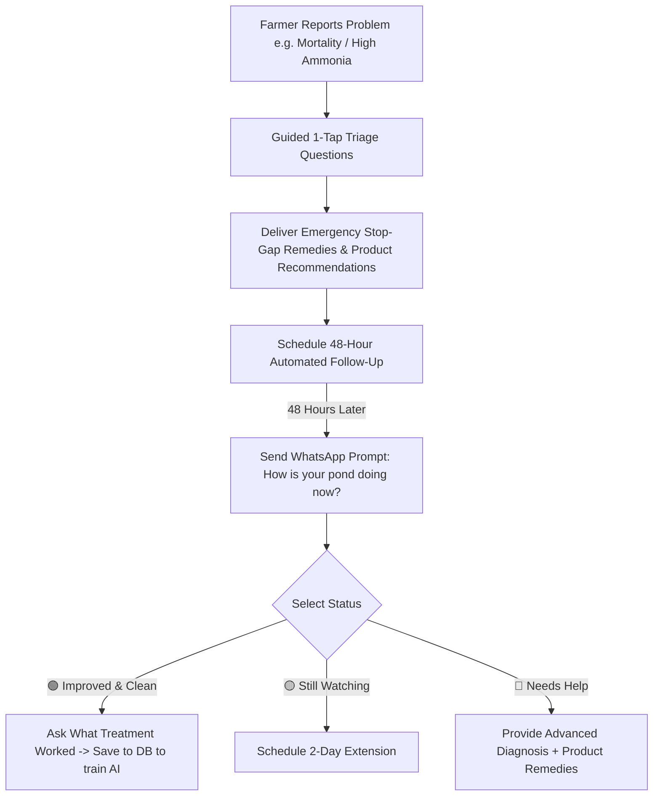
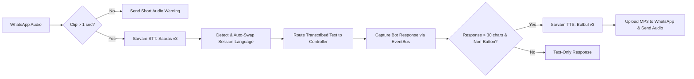

# 🌊 aquaIQ: High-Engagement Interaction & Flow Map

This document maps out the entire conversational experience, architecture, high-converting check-in loops, and logic flow of the **aquaIQ** WhatsApp bot.

---

## 1. High-Converting Onboarding Flow (First-Time Users)
*Goal: Ultra-lean, warm onboarding with zero friction to eliminate drop-off.*

```mermaid
graph TD
    A[Unregistered User Sends Message] --> B[Step 1: Language Selection]
    B -->|English / Telugu / Hindi| C[Step 2: Farm Type Selection]
    C -->|Shrimp / Fish / Both| D[Finalize Onboarding]
    D --> E[Create Farmer & Default Farm Record]
    E --> F[Send Localized Welcome + Pro-Tip + Interactive Menu]
```

### Engagement & Conversion Conventions:
* **Warm Local Greeting:** *"నమస్కారం! 👋 Welcome to aquaIQ — Your Smart Pond Assistant!"*
* **Ultra-Low Friction:** Asks ONLY **Language** & **Farm Type** (completed in <5 seconds).
* **Instant Value Reward:** Immediately sends a customized Pro-Tip and renders the 1-Tap Interactive Topic Menu.
* **Progressive Profiling:** Missing farm parameters (`village`, `species`, `stocking_date`, `seed_count`, `pond_size`) start as `null` and are gathered on-demand via the **Just-In-Time (JIT) Pipeline**.

---

## 2. Just-In-Time (JIT) & Continuous Data Recency Refresh
*Goal: Collect fresh farm data seamlessly right when a feature requires it.*

**Trigger:** User requests a feature (*Feed Plan*, *Water Quality*, or *RAG Question*).

```mermaid
graph TD
    Start[User Triggers Feature e.g. Feed Plan] --> CheckSpecies{Species is placeholder?}
    CheckSpecies -- Yes --> AskSpecies[Prompt 1-Tap Species Buttons]
    CheckSpecies -- No --> CheckDate{Stocking Date is null?}
    CheckDate -- Yes --> AskDate[Prompt Stocking Date e.g. 15/05/2024]
    CheckDate -- No --> CheckSeeds{Seed Count is null?}
    CheckSeeds -- Yes --> AskSeeds[Prompt Seed Stock Quantity]
    CheckSeeds -- No --> CheckStale{Data > 7 days old or missing count?}
    CheckStale -- Yes --> AskRefresh[Prompt 1-Tap Count/Water Status Update]
    AskRefresh --> UpdateDB[Instantly Update Farm & Log Records]
    UpdateDB --> Resume[Execute Action with Fresh Data]
    CheckStale -- No --> Resume
```

* **Seamless Auto-Resume:** Once fresh data is submitted, `resumeOriginalAction()` executes the user's intent without asking them to re-type.

---

## 3. Redesigned Check-In Rotation (High-Engagement Schedule)
*Goal: Zero-typing button check-ins paired with an instant Value-Reward Feedback Loop.*

| Day | Focus Topic | 1-Tap Button Questions | Instant Value Reward / Feedback Delivered |
| :--- | :--- | :--- | :--- |
| **Monday** | 🍽️ **Feed Check** | Feed Brand, Qty Bracket (kg), Frequency | 📊 **Feed Status:** Warns if frequency < 3x/day. Gives FCR optimization tip. |
| **Wednesday**| 💧 **Water Check** | Water Color, Bad Smell, Foam | 🧪 **Water Status:** Calculates Ammonia risk. If bad, alerts to cut feed by 30%. |
| **Friday** | 🔬 **Health Check** | Observed Symptoms, Growth Status | 🩺 **Health Status:** Evaluates growth curves & checks for disease risks. |
| **Sunday** | 📋 **Weekly Review** | Total Weekly Mortality, General Notes | 🏆 **Weekly Health Score Badge:** Displays 7-day health score (e.g. `🟢 88/100 Healthy`). |

### High-Engagement Mechanics:
1. **Optimal Timing:** Check-in notifications are sent at **7:30 AM** (morning pond walk) or **5:30 PM** (evening feed).
2. **Instant Reward Loop:** The bot **never collects data silently**. Completing any check-in immediately returns an updated **Pond Health Score Badge** (`🟢 90/100 Healthy` | `🟡 65/100 Caution`) + **1 Actionable Tip**.
3. **Gentle Nudge Fallback:** If skipped after 6 hours, sends a polite, non-intrusive reminder:
   > *"No rush! Whenever you finish your pond walk, tap below to log today's check-in 🚶‍♂️"*

---

## 4. The "Feed Plan" System (High Value)
*Goal: Deterministic feeding advice based on real-time pond status and live farmer inputs.*

**Trigger:** Farmer selects "Feed Plan" from Menu OR types *"How much feed today?"* / *"మేత ఎంత"*.

### The Calculation Engine:
1. **JIT Validation:** Ensures Stocking Date and Seed Count are present.
2. **Flexible Count Input:**
   * **Automated Estimate:** Calculates $\text{DOC} = \text{Today} - \text{Stocking Date}$ and estimates ABW using species growth curves.
   * **Direct Farmer Input:** Farmer can type/speak count or weight (e.g. *"100 count"* or *"10g"*), which overrides automated estimates.
3. **Biomass & Base Feed Calculation:**
   $$\text{Biomass (kg)} = \frac{\text{Seed Count} \times \text{Estimated Survival(DOC)} \times \text{ABW}}{1000}$$
   $$\text{Base Feed (kg)} = \text{Biomass} \times \text{Feeding Rate \%}(\text{ABW})$$
4. **Contextual Health & Water Adjustments:**
   * **-30% Feed Reduction:** If recent log shows *Brown/Black water* or *Strong smell*.
   * **-50% Feed Reduction:** If recent log shows *Slow growth* or *Disease symptoms*.
   * **100% STOP Feed:** If *White Spot Disease (WSSV)* is logged or detected.

---

## 5. Redesigned Problem & Follow-Up Loop (48-Hour Loop)
*Goal: Empathic troubleshooting with automated outcome tracking.*

**Triggers:** Keywords (*"dead shrimp"*, *"ammonia high"*, *"white spots"*) or Menu selection.

```mermaid
graph TD
    UserProblem[Farmer Reports Problem e.g. Mortality / High Ammonia] --> Triage[Guided 1-Tap Triage Questions]
    Triage --> ImmediateAdvice[Deliver Emergency Stop-Gap Remedies & Product Recommendations]
    ImmediateAdvice --> ScheduleFU[Schedule 48-Hour Automated Follow-Up]
    
    ScheduleFU -->|48 Hours Later| CheckInMsg[Send WhatsApp Prompt: How is your pond doing now?]
    CheckInMsg --> Buttons{Select Status}
    
    Buttons -->|🟢 Improved & Clean| AskTreatment[Ask What Treatment Worked -> Save to DB to train AI]
    Buttons -->|🟡 Still Watching| Extend[Schedule 2-Day Extension]
    Buttons -->|🔴 Needs Help| Escalate[Provide Advanced Diagnosis + Product Remedies]
```

### Interactive Follow-Up Prompts:
* **48-Hour Message:**
  > *"👋 Hi! 2 days ago you reported high ammonia / brown water. How is your pond looking today?"*
  > [🟢 Recovered & Clean] [🟡 Still Watching] [🔴 Needs Help]
* **Treatment Learning Loop:** If the farmer selects **🟢 Recovered**, the bot asks *"Which product/treatment worked?"* and logs it to `pond_logs` (`followup_result`) to build smarter recommendations for local farmers.

---

## 6. AI & Vision Features
*Goal: Expert-level intelligence.*

* **AI Q&A (RAG):** Uses `SHRIMP_KB_AP_COMPLETE.md` to answer free-text farming questions in the farmer's preferred language.
* **Disease Detection (Vision):**
  1. User uploads a shrimp/fish photo.
  2. Bot extracts background Farm Context from DB (species, size, health score, recent log issues).
  3. Gemini Vision model analyzes the image + farm context for a personalized diagnosis.
  4. Instant diagnosis text sent to WhatsApp.
  5. Background worker asynchronously uploads image to **AWS S3** with metadata tags and updates DB chat history.

---

## 7. Voice Message Flow (Indian Languages)
*Goal: Accessible voice-in / voice-out interaction for Indian farmers.*

```mermaid
graph LR
    VoiceNote[WhatsApp Audio] --> AccidentalCheck{Clip > 1 sec?}
    AccidentalCheck -- No --> WarnShort[Send Short Audio Warning]
    AccidentalCheck -- Yes --> SarvamSTT[Sarvam STT: Saaras v3]
    SarvamSTT --> LangDetect[Detect & Auto-Swap Session Language]
    LangDetect --> TextPipeline[Route Transcribed Text to Controller]
    TextPipeline --> EventBus[Capture Bot Response via EventBus]
    EventBus --> TTSEligible{Response > 30 chars & Non-Button?}
    TTSEligible -- Yes --> SarvamTTS[Sarvam TTS: Bulbul v3]
    TTSEligible -- No --> TextOnly[Text-Only Response]
    SarvamTTS --> UploadAudio[Upload MP3 to WhatsApp & Send Audio]
```

### Cost & Billing Optimizations:
* **Accidental Tap Filter:** Voice notes under 1 second are ignored (with a helpful warning).
* **Dynamic Language Swap:** Auto-swaps session language if STT detects farmer speaking in Telugu/Hindi/English.
* **Skip TTS for UI Elements:** Skips audio generation for short responses (<30 chars) or button/list menus.
* **In-Memory LRU Cache:** Prevents duplicate TTS calls for common bot answers.
* **Master Switch:** Global `ENABLE_AUDIO_RESPONSE` env variable can disable TTS instantly.

---

## 8. Interaction Logic, Keyword Interceptors & Global Commands
*Goal: Seamless navigation and bulletproof state control.*

| Trigger / Command | Action Taken |
| :--- | :--- |
| **`stop` / `exit` / `cancel` / `menu`** | Global Exit Handler — immediately cancels any active flow state. |
| **`hi` / `hello` / `namaste`** | Greeting Interceptor — displays main interactive menu list. |
| **`"feed plan"` / `"how much feed"` / `"మేత ఎంత"`** | Feeding Query Interceptor — routes directly to `prob_feed_plan`. |
| **`score` / `health` / `status`** | Displays Pond Health Score (0-100) & Status (Green/Yellow/Red). |
| **Unsupported Media** (Video, Document, Sticker) | Replies with polite fallback explaining supported inputs (Text, Voice, Image). |
| **Duplicate Webhooks** | Deduplicated via `processedMessages` LRU cache. |

---

## 9. Database & State Persistence (Single-Farm Architecture)

* **Single-Farm Model (1 Farm per Farmer):** Every farmer has exactly 1 unified farm record created during onboarding (`pond_number: 1`). There are **no multiple pond creation methods or selection sub-menus**, ensuring maximum simplicity and zero drop-off.
* **Pond Status (`ponds`):** Persists farm brand, stocking date, seed count, pond size, and current biomass for the farmer's single farm unit.
* **Pond Logs (`pond_logs`):** Stores all daily check-ins, water tests, and feed plans as structured `jsonb` linked directly to the farm.
* **Chat History (`chat_history`):** Logs every interaction (text, voice, image) alongside ML metadata and AWS S3 media URLs.
* **State Machine (`conversationState.js`):** In-memory active flow tracking with time-outs and background queue management.
